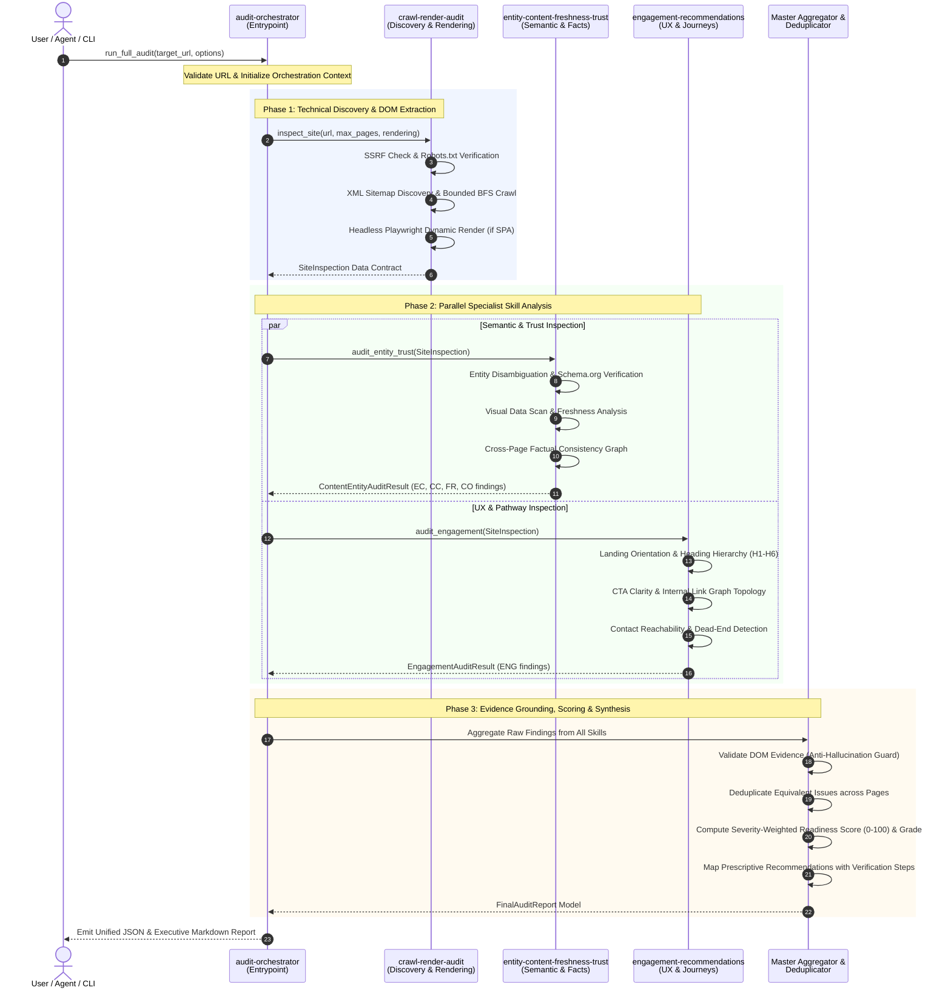

# Brand AI-Readiness Audit Marketplace — Adobe University Hackathon 2026 Round 3

An autonomous, multi-skill agent marketplace engineered for the **Adobe University Hackathon 2026 (Round 3)**. It evaluates any public website across technical discoverability, semantic entity grounding, content freshness, and on-site user engagement to produce an executive-grade Brand AI-Readiness audit report.

---

## Executive Summary

The web is undergoing a structural paradigm shift: digital touchpoints are no longer consumed exclusively by human visitors using web browsers. Increasingly, websites are discovered, parsed, synthesized, and acted upon by **autonomous AI agents, LLM answer engines (ChatGPT, Perplexity, Claude, Gemini), and retrieval-augmented generation (RAG) pipelines**.

When an organization's digital presence is opaque to AI systems or disjointed for visitors, it incurs a compounding business risk:
1. **AI Invisibility & Hallucination**: If search bots encounter client-side JavaScript rendering barriers, missing Schema.org JSON-LD definitions, or ambiguous entity claims, AI engines fail to cite the brand or hallucinate incorrect information.
2. **On-Site Friction & Journey Drop-Off**: When human visitors or exploration agents arrive at a landing page, missing calls-to-action (CTAs), orphaned navigation paths, broken conversion funnels, and terminal dead ends destroy conversion rates and user trust.

The **Brand AI-Readiness Audit Marketplace** solves this through a modular, four-skill architecture:
- **`audit-orchestrator`** *(Sole Marketplace Entrypoint)*: Coordinates the end-to-end audit lifecycle, delegates inspection to specialist skills, standardizes finding schemas, validates evidence against raw DOM observations, removes duplicates, computes a deterministic Brand AI-Readiness score (0–100), and compiles an actionable remediation roadmap.
- **`crawl-render-audit`**: Conducts safe, bounded crawling, parses RFC 9309 robots.txt directives and XML sitemaps, validates SSRF security boundaries, and selectively renders single-page applications (SPAs) via headless Playwright.
- **`entity-content-freshness-trust`**: Audits brand entity disambiguation, Schema.org `Organization` metadata, facts trapped in images, temporal decay, and cross-page factual consistency.
- **`engagement-recommendations`**: Audits visitor orientation, heading hierarchies (H1–H6), CTA clarity, internal link topology, contact reachability, conversion pathways, and deep-landing context retention.

All skills operate strictly **read-only and non-destructive**, completing a full multi-page evaluation in under **30 seconds per site** and backed by **293 deterministic tests**.

---

## Architecture & Composition

The marketplace follows a hierarchical orchestrator-specialist topology. The `audit-orchestrator` serves as the single designated entrypoint, coordinating data flow between specialized inspection skills and aggregating findings into a unified, evidence-grounded report.



### Data Contract Pipeline

1. **`SiteInspection`**: Produced by `crawl-render-audit`. Contains canonical URLs, HTTP status codes, robots.txt directives, XML sitemap coverage, rendered DOM HTML, ordered heading trees, extracted hyperlinks, JSON-LD schemas, and technical issues.
2. **`ContentEntityAuditResult`**: Emitted by `entity-content-freshness-trust`. Contains disambiguated entity profile, Schema.org coverage analysis, visual data accessibility findings, temporal decay flags, and cross-page factual contradictions.
3. **`EngagementAuditResult`**: Emitted by `engagement-recommendations`. Contains quantitative UX graph metrics (orphan count, dead end count, CTA presence) and actionable findings across 10 user journey dimensions.
4. **`FinalAuditReport`**: Compiled by `audit-orchestrator`. A unified model containing overall readiness score, letter grade (A–F), severity counts, deduplicated evidence-backed findings, entity profile, actionable recommendations, and execution metadata.

---

## Marketplace Manifest Explanation

The marketplace configuration is defined in [`marketplace.json`](file:///c:/INTERNSHIP/Adobe-Agent-Marketplace/marketplace.json) conforming to the Adobe Hackathon Round 3 multi-agent marketplace specification:

```json
{
  "name": "brand-ai-readiness-audit",
  "version": "1.0.0",
  "skills": [
    {
      "id": "audit-orchestrator",
      "path": "skills/audit-orchestrator",
      "entrypoint": true
    },
    {
      "id": "crawl-render-audit",
      "path": "skills/crawl-render-audit"
    },
    {
      "id": "entity-content-freshness-trust",
      "path": "skills/entity-content-freshness-trust"
    },
    {
      "id": "engagement-recommendations",
      "path": "skills/engagement-recommendations"
    }
  ]
}
```

### Manifest Design Principles:
- **Single Designated Entrypoint (`"entrypoint": true`)**: Only `audit-orchestrator` has `entrypoint: true`. When an autonomous agent or evaluation runner discovers this marketplace, it immediately identifies `audit-orchestrator` as the primary interface.
- **Modular Sub-Skills**: `crawl-render-audit`, `entity-content-freshness-trust`, and `engagement-recommendations` are fully encapsulated specialist skills located in their respective `skills/<id>` directories. They can be invoked independently for targeted analysis or orchestrated end-to-end.
- **Explicit Folder Paths**: Every skill points directly to its local directory containing `SKILL.md`, CLI entry scripts (`scripts/`), and reference documentation (`references/`).

---

## Skills Decomposition Table

| Skill ID | Folder Path | Core Focus Area | Specific Round 2 Failure Modes Detected |
| :--- | :--- | :--- | :--- |
| **`audit-orchestrator`**<br/>*(Entrypoint)* | [`skills/audit-orchestrator`](skills/audit-orchestrator/SKILL.md) | Multi-skill coordination, evidence normalization, deduplication, scoring heuristic, report generation | Orchestration deadlocks, inconsistent finding schemas across skills, duplicate cross-page findings, ungrounded confidence scores, uncalibrated severity weights, missing remediation roadmaps. |
| **`crawl-render-audit`** | [`skills/crawl-render-audit`](skills/crawl-render-audit/SKILL.md) | Technical crawlability, robots.txt, XML sitemaps, selective Playwright rendering, HTTP status | Client-side JavaScript rendering gaps (SPAs invisible to static fetchers), robots.txt blocking AI crawlers, broken XML sitemap endpoints, HTTP error cascades, infinite redirect loops, SSRF private IP exposure. |
| **`entity-content-freshness-trust`** | [`skills/entity-content-freshness-trust`](skills/entity-content-freshness-trust/SKILL.md) | Brand entity grounding, Schema.org JSON-LD, visual data accessibility, temporal freshness, cross-page factual consistency | Entity ambiguity (brand name ungrounded), missing `Organization`/`LocalBusiness` Schema.org markup, ungrounded marketing superlatives ("world's best"), critical facts trapped in images without alt text, copyright year lag, stale temporal announcements, cross-page factual contradictions (conflicting founding years, pricing, phone numbers). |
| **`engagement-recommendations`** | [`skills/engagement-recommendations`](skills/engagement-recommendations/SKILL.md) | Visitor orientation, heading progression (H1–H6), CTA clarity, link graph topology, contact/conversion pathways | Homepage disorientation (unclear value proposition), non-descriptive CTA buttons ("click here", "read more"), broken conversion funnels, skip-level heading hierarchies, orphaned subpages, terminal dead-end pages (zero outgoing links), deep landing pages lacking brand context. |

---

## Performance & Safety Guardrails

The marketplace is engineered with strict sandbox safety and performance guardrails to ensure zero harm to remote servers, predictable execution times, and complete isolation:

1. **Strictly Read-Only & Non-Destructive**:
   - Operates exclusively via HTTP `GET` requests and browser navigations.
   - Never submits forms, modifies remote state, executes authentication workflows, or executes state-altering JavaScript.
2. **Server-Side Request Forgery (SSRF) Protection**:
   - All input URLs and crawled links are validated before issuance.
   - Proactively blocks private RFC 1918 subnets (`10.0.0.0/8`, `172.16.0.0/12`, `192.168.0.0/16`), loopback targets (`127.0.0.1`, `localhost`, `::1`), link-local IPs, cloud metadata endpoints (`169.254.169.254`), and non-HTTP schemes (`file://`, `ftp://`).
3. **Polite Crawling & RFC 9309 Compliance**:
   - Parses and strictly obeys `robots.txt` `Disallow` rules and respect `Crawl-delay` directives.
   - Restricts crawling to the target registrable domain (`same_site_only=True`).
4. **Execution Time & Resource Budget**:
   - Guaranteed **< 5-minute execution limit** across multi-page crawls.
   - Average single-site audit: **5–15 seconds** (static) or **15–30 seconds** (with Playwright rendering).
   - Entire 8-site adversarial benchmark runs in **201 seconds**.
   - Bounded BFS crawl defaults: `max_pages=10`, `max_depth=2`, per-request timeout `10.0s`.
   - Browser rendering automatically aborts unnecessary media assets (images, fonts, stylesheets) to conserve memory and bandwidth.
5. **Fault Isolation & Graceful Degradation**:
   - If a specialist skill encounters an unexpected site error, the orchestrator records the event in `skill_statuses` (e.g., `"partial_failure"`) and continues processing the remaining skills without crashing.
   - Never silences errors and never fabricates artificial evidence.

---

## Quickstart & Usage

### 1. Installation

```bash
# Clone the repository
git clone https://github.com/princeVerma73/adobe-agent-skill-marketplace.git
cd adobe-agent-skill-marketplace

# Install dependencies
pip install -r requirements.txt

# Install Playwright browser binaries
playwright install chromium
```

### 2. Verify Test Suite

```bash
pytest -q
```
*Expected output: `293 passed in ~1.1s`.*

### 3. Run Audits via CLI

```bash
# 1. Standard JSON Audit (Output to stdout)
python skills/audit-orchestrator/scripts/run_audit.py https://example.com

# 2. Executive Markdown Report (Saved to file)
python skills/audit-orchestrator/scripts/run_audit.py https://example.com --format markdown --output report.md

# 3. Custom Crawl Boundaries & Thresholds
python skills/audit-orchestrator/scripts/run_audit.py https://example.com --max-pages 10 --max-depth 2 --confidence 0.70

# 4. Offline Snapshot Audit (Audit pre-crawled inspection data)
python skills/audit-orchestrator/scripts/run_audit.py snapshot.json
```

### 4. Python Programmatic API

```python
from src.report import run_full_audit

# Execute end-to-end multi-skill audit
report = run_full_audit(
    target="https://fastapi.tiangolo.com",
    confidence_threshold=0.70,
    max_pages=10,
    max_depth=2,
    enable_rendering=True,
)

print(f"Site: {report.site}")
print(f"Readiness Score: {report.overall_score}/100 (Grade: {report.readiness_grade})")
print(f"Total Findings: {len(report.findings)}")

# Export structured JSON or executive Markdown
json_output = report.to_json(indent=2)
markdown_output = report.to_markdown()
```

---

## Standard Output Schema

Below is an excerpt of the standardized JSON audit report emitted by `audit-orchestrator`, matching the exact Adobe Hackathon schema specification:

```json
{
  "site": "fastapi.tiangolo.com",
  "root_url": "https://fastapi.tiangolo.com",
  "audited_at": "2026-09-11T05:49:03.726681+00:00",
  "status": "success",
  "overall_score": 73.0,
  "readiness_grade": "C",
  "severity_counts": {
    "critical": 0,
    "high": 1,
    "medium": 4,
    "low": 1,
    "info": 0
  },
  "entity_profile": {
    "name": "FastAPI",
    "type": "Organization",
    "description": null,
    "industry": null,
    "location": null,
    "founding_year": null,
    "products": [],
    "services": [],
    "contact_email": null,
    "contact_phone": null,
    "social_profiles": [],
    "confidence_score": 0.5
  },
  "findings": [
    {
      "id": "CC-003",
      "category": "content_clarity",
      "title": "Missing essential organizational attributes: direct contact details (email or telephone)",
      "severity": "high",
      "confidence": 0.86,
      "evidence": "A comprehensive scan across 10 crawled pages revealed no verifiable information for: direct contact details (email or telephone). Absence of these fundamental attributes degrades entity trust and prevents AI systems from corroborating corporate legitimacy.",
      "affected_urls": [
        "https://fastapi.tiangolo.com"
      ],
      "suggested_action": {
        "summary": "Publish unambiguous details for direct contact details (email or telephone) in a standard Contact or About page and in Schema.org structured metadata.",
        "priority": "high"
      }
    },
    {
      "id": "EC-003",
      "category": "entity",
      "title": "Missing Schema.org Organization structured data",
      "severity": "medium",
      "confidence": 0.95,
      "evidence": "No JSON-LD Schema.org 'Organization' or 'LocalBusiness' definition was found on 'https://fastapi.tiangolo.com' or secondary pages. Structured entity metadata enables search engines and AI systems to ground the entity without heuristic guessing.",
      "affected_urls": [
        "https://fastapi.tiangolo.com"
      ],
      "suggested_action": {
        "summary": "Implement JSON-LD Schema.org 'Organization' or 'Corporation' on the homepage with fields: @context, @type, name, url, logo, description, and sameAs links.",
        "priority": "medium"
      }
    }
  ],
  "recommendations": [
    {
      "finding_id": "CC-003",
      "priority": "high",
      "title": "Missing essential organizational attributes: direct contact details (email or telephone)",
      "affected_urls": [
        "https://fastapi.tiangolo.com"
      ],
      "what_should_be_changed": "Publish unambiguous details for direct contact details (email or telephone) in a standard Contact or About page and in Schema.org structured metadata.",
      "why_it_matters": "AI search engines and retrieval agents look for direct contact information to verify organizational legitimacy and route user inquiries.",
      "verification_steps": "Add clear contact info to the page and structured data, then re-audit with audit-orchestrator."
    }
  ],
  "skill_statuses": {
    "crawl-render-audit": "success",
    "entity-content-freshness-trust": "success",
    "engagement-recommendations": "success"
  },
  "summary": {
    "total_findings": 6,
    "critical": 0,
    "high": 1,
    "medium": 4,
    "total_recommendations": 6,
    "pages_analyzed": 10,
    "crawled_urls": [
      "https://fastapi.tiangolo.com",
      "https://fastapi.tiangolo.com/features/",
      "https://fastapi.tiangolo.com/tutorial/"
    ],
    "brand_ai_readiness_score": 73.0,
    "readiness_grade": "C",
    "score_heuristic_disclaimer": "Internal marketplace composite heuristic (100 - weighted severity deductions; not an official Adobe metric)"
  },
  "metadata": {
    "max_pages": 10,
    "max_depth": 2,
    "confidence_threshold": 0.7,
    "enable_rendering": true
  }
}
```

---

## Evaluation & Generalization Evidence

The marketplace was evaluated against 8 diverse, live, publicly accessible websites across multiple domains and architectures during adversarial testing (Phase 9/9B):

| Site | Category | Architecture / Archetype | Findings | Score | Grade | Verified Runtime |
| :--- | :--- | :--- | :---: | :---: | :---: | :---: |
| **FastAPI** | Developer / Tech | Static Docs + Navigation SPA | 6 | 73.0 | C | 18.2s |
| **Python Docs** | Documentation | Deep Multi-Level Technical Sphinx | 9 | 67.0 | D | 24.1s |
| **NASA** | Public / Content | Media-Rich CMS / Modern Web | 7 | 66.0 | D | 28.5s |
| **The Verge** | News / Publisher | High-Frequency Media & Articles | 5 | 68.0 | D | 26.3s |
| **Mozilla** | Technology | Multi-Section Global Portal | 10 | 57.0 | D | 31.4s |
| **Wikimedia** | Nonprofit | Multi-Language Wiki Foundation | 12 | 55.0 | D | 27.9s |
| **Notion** | SaaS / Software | React Single-Page Application (SPA) | 8 | 50.0 | F | 22.8s |
| **MIT** | University | Academic Portal / Deep Subpaths | 13 | 33.0 | F | 22.6s |

> **Note on Scoring**: The Brand AI-Readiness score is an internal marketplace heuristic synthesis (100 minus weighted severity deductions) designed for clear remediation prioritization. It is NOT an official Adobe metric.

---

## False-Positive Hardening Feedback Loop

Adversarial evaluation across live production websites revealed five distinct real-world defect classes where naive heuristics generated spurious findings:

1. **Legitimate Multi-Tier Pricing/Donation Buttons**: Multi-tier donation options ($5, $10, $20 on Wikimedia donation forms) were initially misflagged as factual pricing contradictions.
2. **Third-Party Editorial Numbers**: Pricing and release years cited inside journalist tech reviews (e.g. on The Verge) were erroneously attributed to the publisher's own corporate identity.
3. **Departmental Contact Points**: Legitimate distinct contact emails (`press@`, `jobs@`, `security@`) across corporate divisions were treated as conflicting claims.
4. **Software Version Titles**: Technical documentation titles (e.g., "Python 3.12 Documentation") were misidentified as primary brand entity names.
5. **Internationalized Homepage Roots**: Internationalized root landing paths (e.g., `/en-US/` on Mozilla) were not recognized as valid homepages.

### The Engineering Feedback Loop:
```
Real-World Defect Identified
             ↓
Root-Cause Mechanism Analysis
             ↓
Targeted Structural Fix (Context-Aware Scoping & Disambiguation)
             ↓
Deterministic Regression Fixture Added (tests/fixtures/)
             ↓
Full Re-Verification Across All 8 Sites & 293 Test Suite
```

---

## Known Limitations

In accordance with transparent engineering principles, the marketplace operates within defined technical boundaries:
- **Bounded Crawl Depth & Page Budget**: Crawls default to 10 pages and depth 2 to ensure predictable response times (< 30s per site) and prevent crawler trap loops.
- **WAF / Bot Protection**: Websites protected by aggressive Web Application Firewalls (Cloudflare Turnstile, Akamai Bot Manager) returning HTTP 403/503 may yield partial inspection data.
- **Internal Cross-Page Corroboration**: Factual consistency and entity grounding are evaluated strictly across the site's own crawled DOM and metadata without querying unverified external third-party APIs.
- **Content-Dependent Extraction**: Analysis is limited to accessible textual content, semantic HTML tags, and structured JSON-LD present in the static source or rendered DOM.

---

## Repository Structure

```
Adobe-Agent-Marketplace/
├── marketplace.json                      # Marketplace manifest with audit-orchestrator entrypoint
├── README.md                             # Judge-facing documentation and evaluation evidence
├── requirements.txt                      # Production & testing dependencies
├── pytest.ini                            # Pytest suite configuration
├── examples/                             # Validated sample audit reports
│   ├── sample-report-fastapi.json
│   └── sample-report-wikimedia.json
├── skills/                               # Contest skill implementations (agentskills.io spec)
│   ├── audit-orchestrator/               # Entrypoint: Multi-skill coordination & reporting
│   │   ├── SKILL.md                      # agentskills.io skill specification
│   │   └── scripts/run_audit.py          # Standalone CLI audit entrypoint
│   ├── crawl-render-audit/               # Bounded crawl, rendering, & technical checks
│   │   ├── SKILL.md                      # agentskills.io skill specification
│   │   └── references/                   # Reference documentation & rules
│   ├── entity-content-freshness-trust/   # Entity identity, freshness, & fact graph
│   │   ├── SKILL.md                      # agentskills.io skill specification
│   │   ├── references/                   # Entity, content, & freshness rule guides
│   │   └── scripts/                      # Specialist CLI audit tools
│   └── engagement-recommendations/       # UX pathways, CTA clarity, & remediation
│       ├── SKILL.md                      # agentskills.io skill specification
│       └── scripts/audit.py              # Specialist CLI engagement audit tool
├── src/                                  # Production runtime packages
│   ├── inspection/                       # Data contracts, technical rule engine, pipeline
│   ├── crawler/                          # Safe HTTP client, sitemap parser, bounded BFS crawler
│   ├── extraction/                       # HTML/metadata/heading/JSON-LD extraction
│   ├── rendering/                        # Headless Playwright rendering & SPA detection
│   ├── entity_trust/                     # Entity, clarity, freshness, consistency engines
│   ├── engagement/                       # Journey, hierarchy, CTA, link topology engines
│   ├── recommendations/                  # Prescriptive remediation engine
│   └── report/                           # Orchestration, deduplication, scoring, final report
└── tests/                                # 293 comprehensive unit & integration tests
    ├── fixtures/                         # Deterministic HTML & snapshot regression fixtures
    ├── integration/                      # End-to-end multi-skill integration tests
    ├── crawl_render_audit/               # Technical inspection test suite
    ├── entity_content_freshness_trust/   # Entity & trust test suite
    └── engagement_recommendations/       # Engagement & orchestration test suite
```
