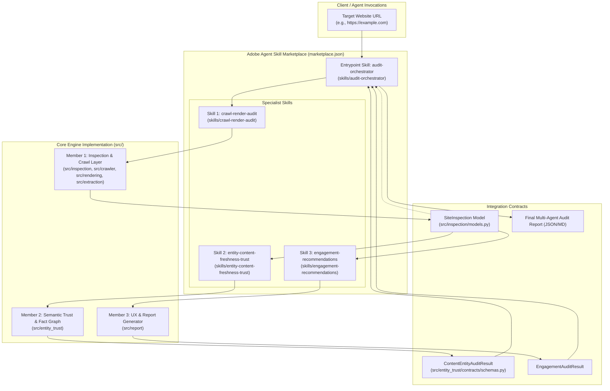
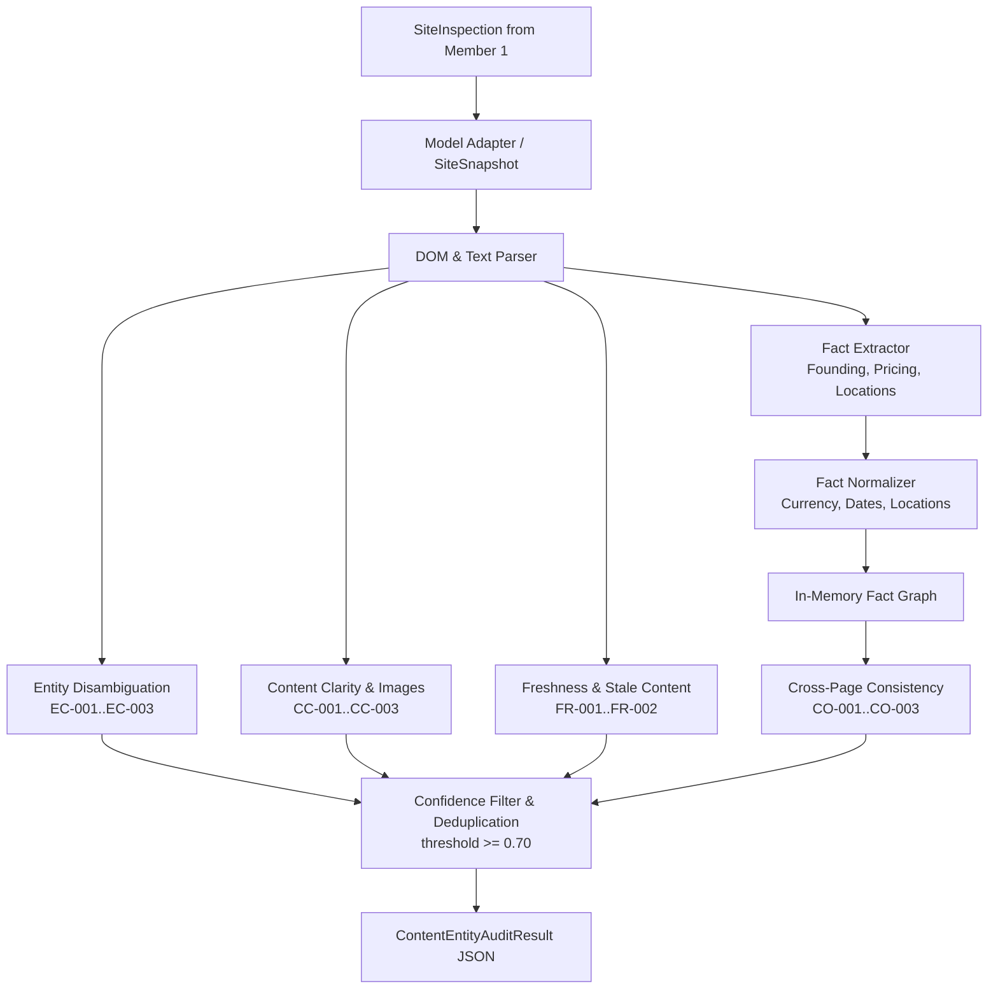
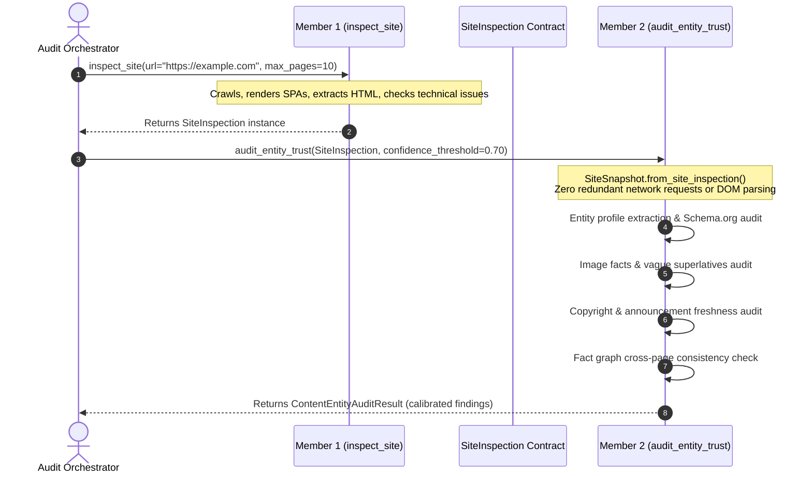
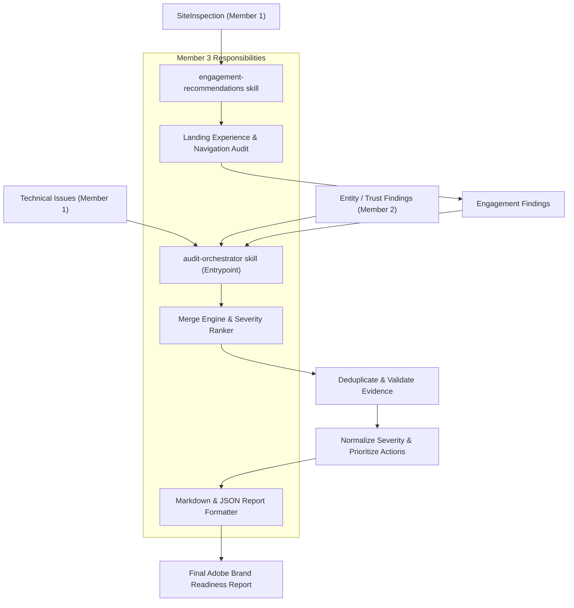
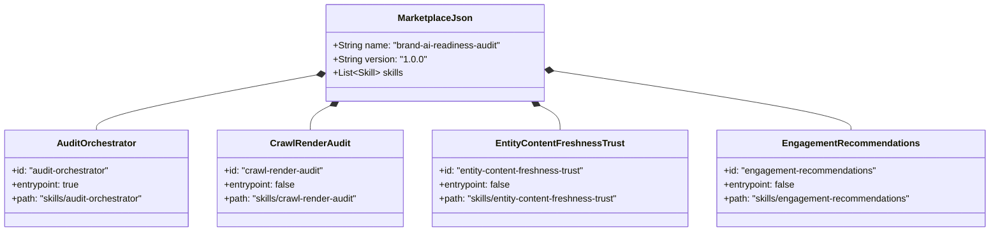
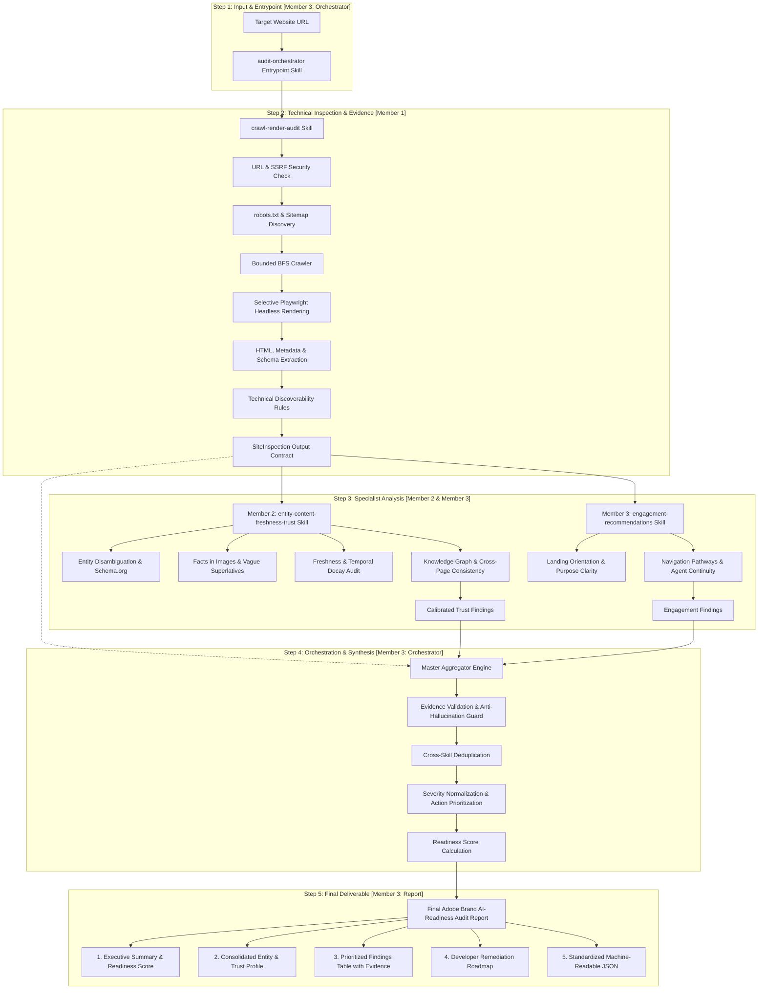

# Brand AI Readiness Audit — Project Understanding Document

> **Team Architecture, Current State, and End-to-End Implementation Guide**  
> *Target Repository: `adobe-agent-skill-marketplace` | Adobe Hackathon Round 3*

---

## 1. Project Goal

### 1.1 The Adobe Round 3 Problem
In the emerging era of AI-driven search engines (e.g., Perplexity, SearchGPT, Google Gemini, Microsoft Copilot) and autonomous answer agents, how websites represent information determines whether automated agents can discover, comprehend, ground, and trust a brand.

Websites built solely for traditional human eyes often fail AI readiness:
- Critical information is trapped inside un-annotated images or dynamic JavaScript SPAs.
- Robots directives and sitemaps inadvertently block indexing crawlers.
- Brand identities are ambiguous, missing Schema.org machine-readable metadata.
- Cross-page factual contradictions (conflicting founding years, locations, pricing) cause AI hallucinations.
- Outdated temporal references (stale copyright years, legacy announcements) degrade brand trust scores.
- Poor landing UX, broken navigation, and lack of next-step pathways prevent agent/user conversion.

**The Challenge:** Build an extensible, multi-skill **Agent Skill Marketplace** that autonomously audits any target website URL, extracts verifiable evidence, evaluates technical, semantic, and engagement readiness, and generates a structured, evidence-backed brand readiness audit report.

### 1.2 What our Agent Skill Marketplace Does
Our system (`brand-ai-readiness-audit`) is structured as a modular marketplace conforming to Adobe Agent conventions (`marketplace.json`). It decomposes website auditing into specialist skills coordinated by an entrypoint orchestrator:

1. **`crawl-render-audit` (Member 1):** Read-only crawl, headless rendering, structured extraction, and technical discoverability checks. Emits the frozen, normalized data contract `SiteInspection`.
2. **`entity-content-freshness-trust` (Member 2):** Semantic identity disambiguation, Schema.org verification, visual fact extraction, temporal decay audit, and cross-page factual consistency via an in-memory knowledge graph.
3. **`engagement-recommendations` (Member 3):** Visitor landing orientation, context retention, navigation pathways, and continuation opportunities.
4. **`audit-orchestrator` (Member 3 / Orchestration):** The marketplace entrypoint skill that coordinates specialist skills, merges findings, filters false positives, validates evidence, normalizes severities, and emits the final unified report.

### 1.3 What Input / Output Means
- **Input:** A single target URL string (e.g., `"https://example.com"`) with optional crawl limits (`max_pages`, `max_depth`, `timeout`, `enable_rendering`).
- **Output:** A standardized, machine-readable, and human-presentable JSON/Markdown audit report containing:
  - Top-level site metadata and inspection summaries.
  - Consolidated entity profile (name, industry, location, confidence).
  - Categorized, prioritized findings with concrete textual/DOM evidence excerpts and source URLs.
  - Actionable remediation recommendations ranked by severity (`critical`, `high`, `medium`, `low`, `info`).

---

## 2. Complete Architecture

### 2.1 Overall System Architecture



---

### 2.2 Member 1 Flow (Inspection & Data Collection)

```mermaid
flowchart LR
    URL[Target URL] --> URLVal[1. URL Validation & SSRF Guard]
    URLVal --> SafeHTTP[2. Safe HTTP & robots.txt Parser]
    SafeHTTP --> Sitemap[3. XML Sitemap Discovery]
    Sitemap --> Crawler[4. Bounded BFS Crawler]
    Crawler --> Render[5. Selective Playwright Rendering]
    Render --> Extract[6. HTML & Metadata Extraction]
    Extract --> TechRules[7. Technical Discoverability Engine]
    TechRules --> SiteInsp[8. SiteInspection Model Output]
```



---

### 2.3 Member 2 Flow (Semantic Identity, Content, Freshness & Consistency)



---

### 2.4 How Member 1 Output Connects to Member 2



---

### 2.5 Member 3 Role & Final Report Flow



---

### 2.6 Skill & Marketplace Composition



---

## 3. Member 1 — Inspection, Crawling & Technical Discoverability

### 3.1 What Was Built
Member 1 built the **read-only inspection foundation** for the entire marketplace. It takes an untrusted target website URL, safely navigates and crawls the domain, conditionally renders single-page applications using headless Chromium, extracts all structural text and metadata, runs deterministic technical discoverability checks, and packages the result into a clean, frozen Pydantic model (`SiteInspection`).

### 3.2 Component Breakdown & Rationale

| Component | Files | Why It Exists & What It Does |
| :--- | :--- | :--- |
| **URL Validation & SSRF Boundary** | `src/inspection/url.py` | Validates URLs, enforces `http`/`https` whitelist, removes fragments/ports, handles Punycode IDNs, and blocks SSRF attacks against loopback (`127.0.0.1`), private RFC 1918 subnets (`10.0.0.0/8`, `192.168.0.0/16`), and AWS/cloud metadata (`169.254.169.254`). |
| **Safe HTTP Client** | `src/crawler/http.py` | Restricts methods strictly to read-only `GET` and `HEAD`. Enforces 10-second timeouts, max 5 redirect hops (re-checking SSRF on every hop), and a 5 MB maximum response body guard to prevent memory exhaustion. |
| **RFC 9309 robots.txt Parser** | `src/crawler/robots.py`, `src/inspection/robots.py` | Parses `robots.txt`, implements User-Agent matching (exact agent falling back to `*`), evaluates `Allow`/`Disallow` with longest-match precedence, extracts `Crawl-delay`, and discovers declared XML sitemaps. |
| **XML Sitemap Discovery** | `src/crawler/sitemap.py`, `src/inspection/sitemap.py` | Resolves sitemaps from `robots.txt` or standard paths (`/sitemap.xml`). Traverses recursive sitemap indexes (`<sitemapindex>`), decompresses gzip feeds (`.xml.gz`), and provides regex fallbacks for malformed XML. |
| **Bounded BFS Crawler** | `src/crawler/crawler.py` | Traverses internal links breadth-first starting from root URL. Strictly bounded by `max_pages` (default 10) and `max_depth` (default 2), strictly isolates same-site registrable domains, checks robots directives prior to each request, and deduplicates visited URLs. |
| **HTML & Metadata Extraction** | `src/extraction/extract.py` | Cleanly extracts title, meta description, canonical URL, robots directives, OpenGraph (`og:*`), Twitter Cards, ordered heading hierarchy (`H1`–`H6`), visible body text (stripping scripts/styles/nav noise), internal/external links, and JSON-LD structured schemas. |
| **Selective Playwright Rendering** | `src/rendering/render.py` | Detects dynamic Single-Page Application (SPA) footprints (React, Vue, Angular, Next.js, Svelte, empty root nodes) or source-vs-rendered text discrepancies. Boots headless Chromium only when necessary, aborting heavy images/fonts/media for speed and safety. |
| **Technical Discoverability Engine** | `src/inspection/technical.py` | Deterministic rule engine evaluating 18+ technical checks across HTTP status, metadata health, heading hierarchies, broken links, canonical consistency, SPA rendering gaps, and JSON-LD schema validity. Emits structured `TechnicalIssue` models. |
| **Unified Inspection Pipeline** | `src/inspection/pipeline.py` | Exposes `inspect_site(...)` and `InspectionPipeline`. Orchestrates the entire flow, gracefully traps network/parser failures, and packages the result into `SiteInspection`. |
| **Skill Interface & Packaging** | `skills/crawl-render-audit/SKILL.md` | Conforms to Adobe Agent Marketplace standards, declaring input parameters, output schemas, and CLI/Python invocation examples. |

### 3.3 Member 1 Test Suite
Member 1 is validated by **193 passing automated tests** across 13 test suites:

- `tests/member1/test_url.py` — Scheme validation, SSRF boundary guards, hostname canonicalization.
- `tests/member1/test_http.py` — Safe read-only HTTP methods, timeouts, redirects, body size guards.
- `tests/member1/test_robots.py` — User-Agent matching, Allow/Disallow precedence, crawl-delays, sitemaps.
- `tests/member1/test_sitemap.py` — XML sitemaps, sitemap indexes, gzip decompression, fallback parsers.
- `tests/member1/test_crawler.py` — Bounded BFS crawl, depth/page limits, domain confinement.
- `tests/member1/test_extraction.py` — HTML metadata, heading hierarchy, noise-free text, JSON-LD schemas.
- `tests/member1/test_rendering.py` — SPA detection, Playwright headless execution, asset blocking.
- `tests/member1/test_technical.py` — Rule-based technical discoverability checks and issue generation.
- `tests/member1/test_models.py` — Pydantic model serialization, validation, and immutability.
- `tests/member1/test_pipeline.py` — End-to-end `InspectionPipeline` orchestration and error recovery.
- `tests/member1/test_contract.py` — Output schema neutrality and downstream contract stability.
- `tests/member1/test_skill_contract.py` — `crawl-render-audit` SKILL.md interface verification.
- `tests/member1/test_integration_contract.py` — Multi-page mock crawl pipeline validation.

---

## 4. Member 2 — Semantic Identity, Content Clarity, Freshness & Trust

### 4.1 What Was Built
Member 2 implements the **semantic knowledge verification, content clarity, and trust audit layer**. It evaluates whether search bots and AI answer engines can accurately ground facts, disambiguate brand identity, and trust website claims.

### 4.2 Inputs and Outputs
- **Input:** Member 1's `SiteInspection` object (or serialized dictionary / `SiteSnapshot`) and a `confidence_threshold` (default `0.70`).
- **Output:** `ContentEntityAuditResult` containing:
  - `entity_profile`: Grounded brand profile (name, industry, location, founding year, contact channels).
  - `findings`: Calibrated, deduplicated, and ranked `Finding` objects (`id`, `category`, `title`, `severity`, `confidence`, `evidence`, `affected_urls`, `suggested_action`).
  - `severity_counts`: Quantitative breakdown across `critical`, `high`, `medium`, `low`, and `info`.
  - `metadata`: Pages analyzed and knowledge graph statistics.

### 4.3 Key Modules and Audit Engines

| Engine / Module | Files | Responsibilities & Findings |
| :--- | :--- | :--- |
| **Model Ingestion & Adapters** | `src/entity_trust/contracts/schemas.py` | `SiteSnapshot.from_site_inspection()` directly ingests Member 1's `SiteInspection` with zero redundant HTML re-parsing or network fetches. |
| **Entity Disambiguation** | `src/entity_trust/audits/entity_audit.py` | Extracts official entity identity from JSON-LD `Organization`/`LocalBusiness`, OpenGraph `og:site_name`, `<title>`, and copyright notices.<br>• `EC-001`: Ambiguous or generic title/H1 concealing brand name.<br>• `EC-002`: Missing business category or industry disambiguation.<br>• `EC-003`: Missing Schema.org machine-readable identity. |
| **Content Clarity & Image Facts** | `src/entity_trust/audits/content_clarity_audit.py` | • `CC-001`: Critical facts (certifications, metrics, awards) locked inside images lacking alt text.<br>• `CC-002`: Unsubstantiated superlative buzzwords (`world-class`, `industry-leading`) without supporting data.<br>• `CC-003`: Missing essential contact or location attributes. |
| **Freshness & Temporal Decay** | `src/entity_trust/audits/freshness_audit.py` | • `FR-001`: Copyright date lag (flagging sites with 2+ years lag relative to reference year 2026).<br>• `FR-002`: Stale announcements or press releases presented as active updates. |
| **Fact Graph & Consistency** | `src/entity_trust/core/fact_extractor.py`<br>`src/entity_trust/core/fact_normalizer.py`<br>`src/entity_trust/core/fact_graph.py`<br>`src/entity_trust/audits/consistency_audit.py` | Extracts and canonicalizes founding years, currencies (`$`, `USD`, `INR`, `€`), locations, phone numbers, and pricing.<br>• Builds an in-memory knowledge graph clustering cross-page claims.<br>• `CO-001+`: Flags cross-page factual contradictions (e.g., "Founded in 2018" on About page vs. "Founded in 2021" on Homepage). |
| **Confidence & False-Positive Filter** | `src/entity_trust/core/confidence.py` | Suppresses speculative findings where confidence score < 0.70. Deduplicates findings across pages and ranks severity from critical to info. |
| **Compatibility Layer** | `member2/__init__.py`, `member2/cli.py`, `member2/runner.py` | Re-exports `src.entity_trust` modules under `member2` for backward-compatible imports. |

### 4.4 Member 2 Test Suite
Member 2 is validated by **24 passing automated tests** (8 dedicated test modules + 1 integration test module):

- `tests/member2/test_member2_contracts.py` — Direct ingestion of `SiteInspection` models and serialized dictionaries.
- `tests/member2/test_entity_audit.py` — Brand disambiguation, missing Schema.org, and ambiguous title/H1 audits.
- `tests/member2/test_content_clarity_audit.py` — Facts locked in images, vague superlatives, missing contact channels.
- `tests/member2/test_freshness_audit.py` — Outdated copyright timestamps and stale announcements.
- `tests/member2/test_fact_normalizer.py` — Normalization of currencies, years, and geographic locations.
- `tests/member2/test_fact_extractor_and_graph.py` — Structured fact extraction and conflict graph clustering.
- `tests/member2/test_runner_e2e.py` — End-to-end execution across 5 realistic site mock fixtures.
- `tests/member2/test_member2_skill_contract.py` — Skill metadata, references, scripts, and parameter alignment.
- `tests/integration/test_member1_member2_integration.py` — Verification of direct Member 1 `SiteInspection` piping to Member 2.

---

## 5. Q&A / Project Understanding

### Q1: What happens when a URL enters the system?
1. The entrypoint skill (`audit-orchestrator`) receives the URL.
2. Member 1 validates the URL, resolves DNS, and verifies that the target is not a private/loopback/cloud metadata IP (SSRF guard).
3. Member 1 checks `robots.txt` and XML sitemaps, then crawls internal links up to `max_pages=10` and `max_depth=2` via BFS.
4. If a page is a JavaScript SPA or exhibits content discrepancies, Member 1 renders it via headless Playwright.
5. Member 1 extracts metadata, headings, text, links, and JSON-LD schemas, runs technical checks, and returns a `SiteInspection` object.
6. The `SiteInspection` object is handed to Member 2 and Member 3 in memory.
7. Member 2 extracts entity profiles, audits Schema.org, checks image facts, detects temporal decay, and builds a fact graph to catch cross-page contradictions.
8. Member 3 audits engagement/navigation pathways.
9. The orchestrator merges all findings, validates textual evidence, normalizes severities, prioritizes remediation steps, and outputs the final audit report.

### Q2: Why do we need `robots.txt`?
`robots.txt` is the web standard (RFC 9309) that site owners use to instruct automated agents and search crawlers which paths they are allowed or forbidden to crawl. An AI readiness audit must verify if critical brand content is accidentally disallowed for AI user-agents and ensure the auditor itself operates ethically and safely.

### Q3: Why Breadth-First Search (BFS)?
BFS traverses pages level-by-level (depth 0 = root, depth 1 = main navigation, depth 2 = subpages). For website audits, top-level navigational pages contain the highest density of brand identity, structured data, and core offerings. BFS ensures the crawler discovers the most critical pages before exhausting `max_pages` limits, unlike Depth-First Search (DFS) which risks getting trapped in deep pagination or blog archives.

### Q4: Why Playwright?
Modern web frameworks (React, Vue, Angular, Next.js, Nuxt, Svelte) often serve empty HTML shells (`<div id="root"></div>`) where content is populated via client-side JavaScript. Traditional static HTTP scrapers miss this content entirely. Playwright boots headless Chromium to execute the JavaScript and expose the fully hydrated DOM. To maintain fast audit speeds, our pipeline uses *selective rendering*: static HTML is checked first, and Playwright is only booted if SPA signatures or text discrepancies are detected.

### Q5: What is `SiteInspection`?
`SiteInspection` is the neutral, frozen Pydantic data model emitted by Member 1 (`src/inspection/models.py`). It acts as the single source of truth for all downstream skills, containing the site hostname, canonical root URL, parsed `robots.txt` rules, XML sitemap findings, a list of `PageInspection` objects (with HTML, metadata, headings, links, JSON-LD, rendered DOM, and technical issues), and summary counts.

### Q6: What does Member 1 give Member 2?
Member 1 provides the complete, normalized `SiteInspection` object. Member 2 consumes this directly without making any additional network requests or re-parsing raw HTML.

### Q7: What does Member 2 add?
Member 2 adds high-level semantic, trust, and knowledge verification:
- **Brand Entity Profile:** Disambiguates whether the site is a company, SaaS, local business, or nonprofit.
- **Machine Readability:** Checks for Schema.org JSON-LD coverage.
- **Visual Fact Auditing:** Flags facts trapped inside un-annotated images.
- **Temporal Freshness:** Catches copyright lag and stale announcements.
- **Cross-Page Consistency:** Constructs an in-memory knowledge graph to detect factual contradictions across different pages.
- **Calibrated Findings:** Applies confidence scoring (>= 0.70) to eliminate false alarms.

### Q8: What happens if a page fails during the crawl?
The inspection pipeline uses defensive error isolation. If a page returns an HTTP error (404, 500), times out, or encounters a parse error, the pipeline does not crash. Instead, it records a `PageInspection` entry with the error status code, logs a structured `TechnicalIssue` (e.g., `HTTP_ERROR`), increments the error count in `summary_counts`, and continues crawling the remaining discovered pages.

### Q9: What is the difference between "evidence" and a "finding"?
- **Evidence:** Raw, factual observation extracted directly from the website (e.g., a specific HTML snippet, a quoted sentence from body text, an HTTP status code, or a missing JSON-LD tag) accompanied by the source page URL.
- **Finding:** An actionable, evaluated audit item containing an issue ID, category, human-readable title, calibrated severity (`critical`, `high`, `medium`, `low`, `info`), confidence score, attached evidence, and a concrete suggested remediation action.

### Q10: Why is there only one entrypoint skill?
The Adobe Agent Marketplace architecture requires a single unified entrypoint skill (`audit-orchestrator` marked with `"entrypoint": true` in `marketplace.json`). This provides a clean, single-point API for external agents or humans, while internally delegating specialized sub-tasks to modular specialist skills.

### Q11: How does the final report get created?
The `audit-orchestrator` gathers raw technical issues from Member 1, semantic trust findings from Member 2, and UX findings from Member 3. It runs a deduplication and cross-validation pass to ensure all evidence strings actually exist in the crawl data, calculates global severity rankings and brand readiness scores, and compiles the result into a clean, structured JSON object and a beautifully formatted Markdown report.

---

## 6. Current Implementation Status

```
Overall Status: 🟢 Member 1 Done | 🟢 Member 2 Done | 🟡 Member 3 / Orchestration In Progress
```

### 6.1 Status Matrix

| Subsystem / Deliverable | Owner | Current Status | Test Coverage |
| :--- | :--- | :---: | :--- |
| **Phase 1: URL & SSRF Boundary** | Member 1 | 🟢 Completed | 100% (Passed) |
| **Phase 2: Safe HTTP & robots.txt** | Member 1 | 🟢 Completed | 100% (Passed) |
| **Phase 3: Sitemap & Bounded BFS Crawler** | Member 1 | 🟢 Completed | 100% (Passed) |
| **Phase 4: Extraction & Playwright Rendering** | Member 1 | 🟢 Completed | 100% (Passed) |
| **Phase 5: Technical Discoverability Rules** | Member 1 | 🟢 Completed | 100% (Passed) |
| **Phase 6: Unified `inspect_site` Pipeline** | Member 1 | 🟢 Completed | 100% (Passed) |
| **Phase 7: `crawl-render-audit` Skill** | Member 1 | 🟢 Completed | 100% (Passed) |
| **Phase 8: `SiteInspection` Data Contract** | Member 1 | 🟢 Completed | 100% (Passed) |
| **Model Ingestion & Adapters (`SiteSnapshot`)** | Member 2 | 🟢 Completed | 100% (Passed) |
| **Entity Disambiguation & Schema.org (`EC-001..3`)** | Member 2 | 🟢 Completed | 100% (Passed) |
| **Content Clarity & Image Facts (`CC-001..3`)** | Member 2 | 🟢 Completed | 100% (Passed) |
| **Freshness & Stale Content (`FR-001..2`)** | Member 2 | 🟢 Completed | 100% (Passed) |
| **Fact Normalizer, Extractor & Knowledge Graph** | Member 2 | 🟢 Completed | 100% (Passed) |
| **Cross-Page Consistency Engine (`CO-001+`)** | Member 2 | 🟢 Completed | 100% (Passed) |
| **Confidence Scoring & False-Positive Filter** | Member 2 | 🟢 Completed | 100% (Passed) |
| **`entity-content-freshness-trust` Skill** | Member 2 | 🟢 Completed | 100% (Passed) |
| **M1 ➔ M2 Direct Integration Contract** | M1 + M2 | 🟢 Completed | 100% (Passed) |
| **`engagement-recommendations` Skill & Engine** | Member 3 | 🟡 Skeleton Only | Missing engine & tests |
| **`audit-orchestrator` Master Entrypoint** | Member 3 | 🟡 Skeleton Only | Missing orchestration code |
| **Final Report Generator (`src/report/`)** | Member 3 | 🟡 Skeleton Only | Missing Markdown/JSON report builder |
| **Cross-Skill Severity Normalizer & Deduplicator**| Member 3 | 🔴 Pending | Not yet implemented |
| **Unseen-Site Real-World Benchmark Suite** | All | 🔴 Pending | Fixtures only, real-world live tests pending |

---

## 7. Remaining Work

Based on exact repository inspection, the following components remain to be completed:

### 7.1 Member 3: Engagement & Recommendations Audit Engine
- [ ] Implement `src/engagement/` (or `src/recommendations/`) audit engine:
  - Landing experience and site value clarity audit.
  - Context retention and navigation hierarchy verification.
  - Identification of broken conversion pathways or dead ends for automated agents.
- [ ] Complete `skills/engagement-recommendations/SKILL.md` with full execution scripts and test contracts.
- [ ] Build automated unit tests in `tests/member3/`.

### 7.2 Member 3 / Orchestration: Master `audit-orchestrator`
- [ ] Implement `src/orchestrator/` or `skills/audit-orchestrator/scripts/run_audit.py`:
  - Top-level CLI and Python entrypoint accepting target URL.
  - Sequential/parallel invocation of Member 1 (`inspect_site`), Member 2 (`audit_entity_trust`), and Member 3 (`audit_engagement`).
  - Findings aggregation, cross-skill deduplication, and evidence grounding verification.
  - Overall brand AI-readiness score calculation (0–100 scale).

### 7.3 Final Report Generation (`src/report/`)
- [ ] Implement structured report builder in `src/report/`:
  - Machine-readable JSON output conforming strictly to Adobe Hackathon contract.
  - Clean, executive-ready Markdown summary with tables, severity badges, and remediation roadmaps.

### 7.4 Cross-Team Integration & Final Packaging
- [ ] End-to-end integration tests: `tests/integration/test_end_to_end_pipeline.py`.
- [ ] Benchmark testing across diverse real-world websites (SPAs, legacy CMS, e-commerce, documentation portals) to calibrate false positives.
- [ ] Verification of `marketplace.json` conformance and submission packaging.

---

## 8. Final End-to-End Flow Diagram



---

## 9. Summary for Team Sync & Presentations

- **Member 1** is 100% complete with 193 passing tests. It provides the rock-solid, secure, SSRF-safe crawling, rendering, and technical discoverability backbone.
- **Member 2** is 100% complete with 24 passing tests (217 passed overall). It directly consumes Member 1's models to audit brand identity, image facts, temporal staleness, and cross-page factual consistency via an in-memory knowledge graph.
- **Member 3** is the current focus area: building the engagement/recommendations audit engine, implementing the master `audit-orchestrator` to fuse findings, generating the final Markdown/JSON report, and conducting full end-to-end integration and real-world benchmark testing.
