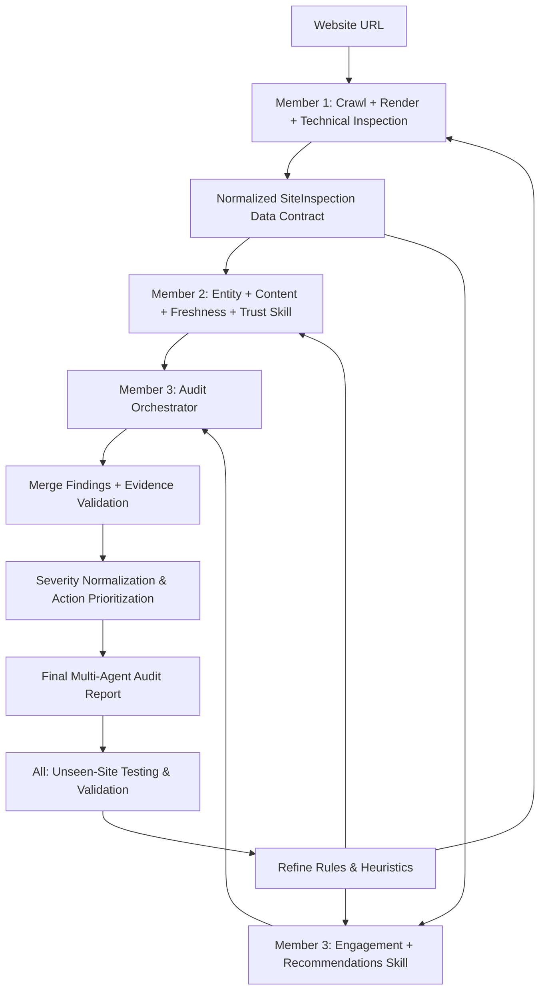
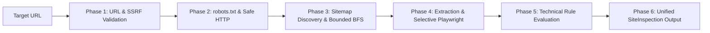

# Team Workflow & Architecture

This document describes the multi-agent workflow, data flow, and integration contracts across team members.

## End-to-End Workflow

---

## Member Roles & Responsibilities

| Role | Domain / Module | Primary Artifacts | Status |
| :--- | :--- | :--- | :--- |
| **Member 1** | Crawl, Rendering, Technical Discoverability | `src/inspection`, `src/crawler`, `src/rendering`, `src/extraction`, `skills/crawl-render-audit` | **Completed (193/193 tests passed)** |
| **Member 2** | Entity Extraction, Content Quality, Freshness, Trust | `skills/entity-content-freshness-trust` | Pending / In Progress |
| **Member 3** | Engagement, Recommendations, Orchestrator, Report | `skills/engagement-recommendations`, `skills/audit-orchestrator`, `src/report` | Pending / In Progress |
| **All Members** | Integration testing, unseen domain auditing, benchmark calibration | `tests/integration/`, `examples/` | Ongoing |

---

## Member 1 Data Flow & Pipeline Stages

Member 1 operates as a deterministic, read-only data provider:

1. **Validation & SSRF Guard:** Canonicalizes target URL, verifies `http`/`https` scheme, and blocks private/loopback/cloud metadata IP ranges.
2. **Robots & Safe HTTP:** Fetches and parses `robots.txt` via read-only GET/HEAD requests with timeout and body size protections.
3. **Sitemap & Bounded BFS Crawl:** Locates XML sitemaps, traverses links via BFS capped by `max_pages` and `max_depth`, strictly isolating the target domain.
4. **Extraction & Selective Rendering:** Extracts headings, body text, metadata, links, and JSON-LD structured data. Conditionally triggers Playwright headless browser rendering for dynamic SPAs.
5. **Technical Discoverability:** Evaluates rule-based checks for crawl, indexability, metadata, heading hierarchy, link health, SPA dependency, and schema syntax.
6. **Data Contract Emission:** Serializes normalized `SiteInspection` Pydantic models for downstream consumption by Member 2 and Member 3.

---

## Shared Integration Contract

The integration contract between Member 1 and downstream consumers is defined in `src/inspection/models.py`:

- **Input:** Target URL string (e.g., `"https://example.com"`) and optional `PipelineConfig` parameters.
- **Output:** `SiteInspection` model containing:
  - `site` (hostname) and `root_url` (canonical entrypoint).
  - `robots`: `RobotsTxtInspection` (crawl rules, sitemap declarations, delays).
  - `sitemap`: `SitemapInspection` (discovered XML sitemaps, page URL lists).
  - `pages`: List of `PageInspection` records (metadata, headings, body text, links, structured data, rendered DOM comparisons, and `technical_issues`).
  - `summary_counts`: Quantitative metrics for quick aggregation.

