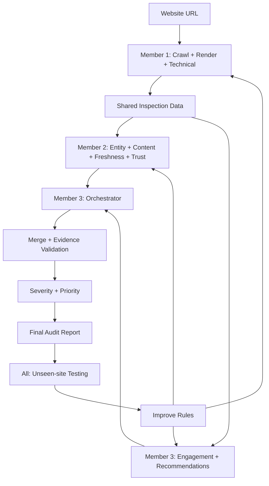

# Team Workflow

```mermaid
flowchart TD
 A[Website URL] --> B[Member 1: Crawl + Render + Technical]
 B --> C[Shared Inspection Data]
 C --> D[Member 2: Entity + Content + Freshness + Trust]
 C --> E[Member 3: Engagement + Recommendations]
 D --> F[Member 3: Orchestrator]
 E --> F
 F --> G[Merge + Evidence Validation]
 G --> H[Severity + Priority]
 H --> I[Final Audit Report]
 I --> J[All: Unseen-site Testing]
 J --> K[Improve Rules]
 K --> B
 K --> D
 K --> E
```
