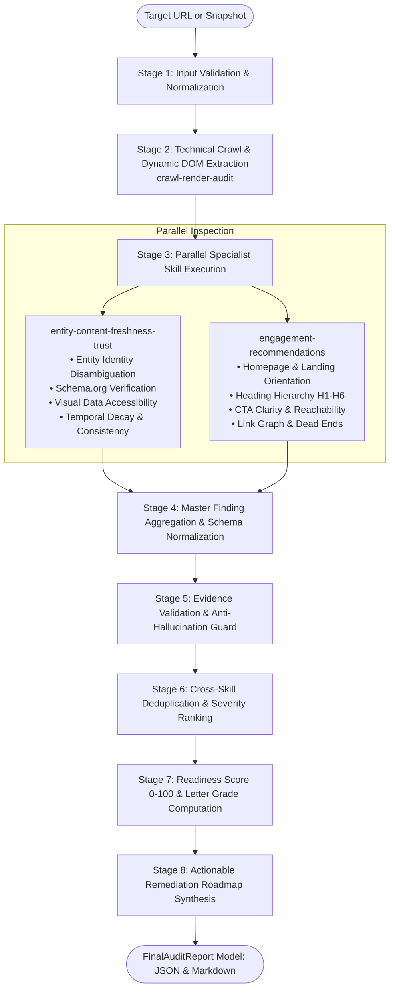

# Audit Orchestrator Skill

## Purpose
The `audit-orchestrator` is the primary designated entrypoint skill (`"entrypoint": true` in `marketplace.json`) for the Adobe Agent Skill Marketplace (`brand-ai-readiness-audit`). It coordinates the end-to-end auditing lifecycle: safely inspecting the domain via `crawl-render-audit`, analyzing semantic trust and entity consistency via `entity-content-freshness-trust`, evaluating user journeys and navigation pathways via `engagement-recommendations`, validating evidence against raw observations to prevent hallucination, deduplicating equivalent findings, computing a calibrated Brand AI-Readiness score (0–100), and compiling an actionable remediation roadmap.

## When to Use
Trigger this skill when:
- An autonomous AI agent, evaluator, or user requests a comprehensive Brand AI-Readiness audit of a public website or pre-extracted snapshot.
- Evaluating a website across multiple dimensions simultaneously (technical discoverability, entity grounding, content freshness, and on-site engagement).
- Synthesizing findings from multiple specialized inspection tools into a single, deduplicated, and prioritized executive report.
- Generating prescriptive remediation actions with verifiable verification steps.
- Computing an overall Brand AI-Readiness score (0–100) and letter grade (A–F) for competitive benchmarking.

## Inputs
| Parameter | Type | Default | Description |
| :--- | :--- | :--- | :--- |
| `target` | `str` \| `SiteInspection` \| `dict` | *(required)* | Target root website URL, pre-extracted `SiteInspection` object, or JSON snapshot dict. |
| `confidence_threshold` | `float` | `0.70` | Minimum confidence score (0.0 to 1.0) required to retain and report a finding. |
| `max_pages` | `int` | `10` | Maximum number of pages to crawl when `target` is a URL. |
| `max_depth` | `int` | `2` | Maximum link depth from root URL. |
| `timeout` | `float` | `10.0` | Per-request timeout in seconds for HTTP and browser requests. |
| `same_site_only` | `bool` | `True` | Restrict crawling strictly to the target registrable domain. |
| `respect_robots` | `bool` | `True` | Respect robots.txt allow and disallow directives. |
| `discover_sitemaps` | `bool` | `True` | Automatically discover and parse XML sitemaps. |
| `enable_rendering` | `bool` | `True` | Selectively render single-page application (SPA) dynamic DOM with headless Playwright. |

## Procedure

The orchestrator executes an 8-stage deterministic audit pipeline:



### Step-by-Step Execution:
1. **Target Ingestion & Validation**: Ingests either a raw URL or a pre-extracted `SiteInspection` snapshot. Normalizes URLs and applies SSRF security checks.
2. **Technical Crawl & Render**: Invokes `crawl-render-audit` to inspect `robots.txt`, parse XML sitemaps, perform a bounded BFS crawl, and conditionally render JavaScript SPAs with headless Playwright.
3. **Parallel Specialist Analysis**:
   - Dispatches `SiteInspection` to `entity-content-freshness-trust` for entity disambiguation, Schema.org coverage, temporal freshness, and cross-page factual consistency graph analysis.
   - Dispatches `SiteInspection` to `engagement-recommendations` for orientation, heading progression, CTA visibility, link graph topology, and dead-end discovery.
4. **Master Finding Aggregation**: Normalizes diverse specialist outputs (`EC-*`, `CC-*`, `FR-*`, `CO-*`, `ENG-*`, `CR-*`) into a standardized `ReportFinding` schema.
5. **Evidence Validation & Anti-Hallucination Guard**: Verifies every finding against the raw extracted DOM and page text to prevent hallucinated or unsupported claims.
6. **Cross-Skill Deduplication**: Merges overlapping issues identified across multiple pages or skills, consolidating affected URLs into unified finding items.
7. **Readiness Scoring & Letter Grade**: Calculates a composite Brand AI-Readiness score (0.0–100.0) based on severity-weighted deductions and assigns a letter grade (`A`, `B`, `C`, `D`, or `F`).
8. **Remediation Roadmap Synthesis**: Maps all confirmed findings to prioritized actionable recommendations with concrete changes, business rationale, and verification steps.

## Safe and Read-Only Behavior
- **Zero Remote Mutations**: Operates strictly via read-only HTTP GET requests and browser navigations. Never submits forms, executes transactions, or alters server-side state.
- **SSRF Network Guard**: Validates all targets against loopback, private RFC 1918 addresses, and invalid schemes.
- **Fault Isolation**: Individual skill failures are captured in `skill_statuses` (e.g. `"partial_failure"`) without terminating the orchestration pipeline or dropping findings from healthy skills.

## Outputs

Returns a structured `FinalAuditReport` data contract matching Adobe Hackathon Round 3 standards:

```json
{
  "site": "example.com",
  "root_url": "https://example.com",
  "audited_at": "2026-09-12T14:30:00.000000+00:00",
  "status": "success",
  "overall_score": 85.0,
  "readiness_grade": "B",
  "severity_counts": {
    "critical": 0,
    "high": 1,
    "medium": 2,
    "low": 1,
    "info": 0
  },
  "entity_profile": {
    "name": "Example Corp",
    "type": "Organization",
    "description": "Example description",
    "industry": "Technology",
    "location": "San Francisco, CA",
    "founding_year": 2020,
    "products": ["Product A"],
    "services": [],
    "contact_email": "contact@example.com",
    "contact_phone": "+1-800-555-0199",
    "social_profiles": ["https://twitter.com/example"],
    "confidence_score": 0.92
  },
  "findings": [
    {
      "id": "EC-003",
      "category": "entity",
      "title": "Missing Schema.org Organization structured data",
      "severity": "medium",
      "confidence": 0.95,
      "evidence": "No JSON-LD Schema.org 'Organization' definition found on homepage.",
      "affected_urls": ["https://example.com"],
      "suggested_action": {
        "summary": "Implement JSON-LD Schema.org Organization on the homepage.",
        "priority": "medium"
      }
    }
  ],
  "recommendations": [
    {
      "finding_id": "EC-003",
      "priority": "medium",
      "title": "Missing Schema.org Organization structured data",
      "affected_urls": ["https://example.com"],
      "what_should_be_changed": "Add JSON-LD Schema.org Organization markup to the root template.",
      "why_it_matters": "Structured entity metadata enables search engines and AI agents to ground entity identity without guessing.",
      "verification_steps": "Verify JSON-LD with Google Rich Results Test or re-run audit-orchestrator."
    }
  ],
  "skill_statuses": {
    "crawl-render-audit": "success",
    "entity-content-freshness-trust": "success",
    "engagement-recommendations": "success"
  },
  "summary": {
    "total_findings": 4,
    "critical": 0,
    "high": 1,
    "medium": 2,
    "total_recommendations": 4,
    "pages_analyzed": 10,
    "crawled_urls": ["https://example.com", "https://example.com/about"],
    "brand_ai_readiness_score": 85.0,
    "readiness_grade": "B",
    "score_heuristic_disclaimer": "Internal marketplace composite heuristic (100 - weighted severity deductions; not an official Adobe metric)"
  },
  "metadata": {
    "max_pages": 10,
    "max_depth": 2,
    "confidence_threshold": 0.7,
    "enable_rendering": true
  }
}
```

## Usage and Pipeline Integration

### Python Programmatic API
```python
from src.report import run_full_audit

# Run end-to-end multi-skill audit
report = run_full_audit(
    target="https://example.com",
    confidence_threshold=0.70,
    max_pages=10,
    max_depth=2,
    enable_rendering=True,
)

print(f"Site: {report.site}")
print(f"Readiness Score: {report.overall_score}/100 (Grade: {report.readiness_grade})")
print(f"Total Findings: {len(report.findings)}")

# Export Markdown summary
markdown_text = report.to_markdown()

# Export standardized JSON
json_text = report.to_json(indent=2)
```

### Standalone CLI Execution
```bash
# Output JSON report to stdout
python skills/audit-orchestrator/scripts/run_audit.py https://example.com

# Output Markdown report saved to file
python skills/audit-orchestrator/scripts/run_audit.py https://example.com --format markdown --output report.md

# Audit existing snapshot JSON offline
python skills/audit-orchestrator/scripts/run_audit.py snapshot.json
```
