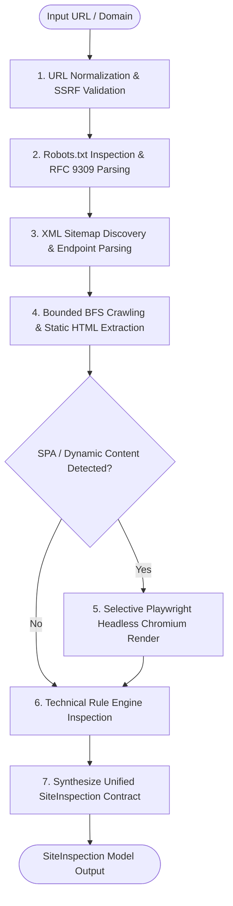

# Crawl & Render Audit Skill

## Purpose
The `crawl-render-audit` skill provides deterministic, evidence-based technical inspection of a target website. It systematically evaluates whether website content is reachable, machine-readable, and indexable by automated systems, search engine crawlers, and AI agents without mutating remote site state.

## When to Use
Use this skill when:
- An orchestrator or downstream specialist skill needs raw, structured inspection data (`SiteInspection`) and technical evidence for a domain.
- Auditing site technical health, HTTP status codes, redirect chains, robots.txt compliance, and XML sitemap discoverability.
- Detecting client-side JavaScript rendering dependencies (SPA frameworks like React, Vue, Next.js, Nuxt) and content gaps between static source HTML and the rendered DOM.
- Extracting clean metadata, ordered heading hierarchy (H1–H6), visible body text, internal/external hyperlinks, and Schema.org JSON-LD structured data.
- Detecting technical discoverability failures such as crawl blocks, missing titles/descriptions, and broken internal links.

## Safe and Read-Only Behavior
This skill enforces strict safety and non-destructive inspection boundaries:
- **GET-Only Navigation**: Operates strictly via read-only HTTP GET requests and browser page navigations.
- **No Mutations / Form Submissions**: Never fills forms, submits POST data, executes logins, or modifies remote state.
- **SSRF & Private Target Guard**: Validates URLs before request execution and blocks private IP addresses (`10.0.0.0/8`, `172.16.0.0/12`, `192.168.0.0/16`), loopback addresses (`localhost`, `127.0.0.1`, `[::1]`), link-local targets, and non-web schemes.
- **Bounded Resource Usage**: Respects configurable page counts (`max_pages`), crawl depths (`max_depth`), execution timeouts (`timeout`), and aborts unnecessary heavy media assets (images, fonts, stylesheets) during browser rendering.
- **Robots.txt Adherence**: Respects RFC 9309 crawl directives, disallow rules, and crawl-delay intervals.

## Inputs
| Parameter | Type | Default | Description |
| :--- | :--- | :--- | :--- |
| `url` | `str` | *(required)* | Target root URL or bare domain (e.g. `"https://example.com"` or `"example.com"`). |
| `max_pages` | `int` | `10` | Maximum number of pages to crawl during bounded BFS traversal. |
| `max_depth` | `int` | `2` | Maximum link depth level from root page. |
| `timeout` | `float` | `10.0` | Timeout in seconds for HTTP and browser requests. |
| `same_site_only` | `bool` | `True` | Confine crawl strictly to the same registrable domain and subdomains. |
| `respect_robots` | `bool` | `True` | Respect robots.txt allow and disallow directives. |
| `discover_sitemaps` | `bool` | `True` | Automatically discover and parse XML sitemaps declared in robots.txt or standard paths. |
| `enable_rendering` | `bool` | `True` | Selectively render dynamic/SPA pages with Playwright when static HTML lacks content. |

## Procedure

The inspection follows a deterministic, 7-step pipeline:



### Step-by-Step Execution:
1. **URL Normalization & SSRF Validation**: Normalizes bare domains to standard HTTPS URLs, checks against SSRF blacklists (blocking private IP ranges, loopback, link-local, and non-HTTP schemes).
2. **Robots.txt Inspection**: Fetches and parses `/robots.txt` conforming to RFC 9309, extracting user-agent rules, crawl delays, and declared sitemap endpoints.
3. **XML Sitemap Discovery**: Automatically probes standard sitemap locations (e.g. `/sitemap.xml`, `/sitemap_index.xml`) and parses URL sets.
4. **Bounded BFS Crawl & Static Extraction**: Traverses site pages up to `max_pages` and `max_depth`, extracting title tags, meta descriptions, canonical URLs, headings (H1–H6), hyperlinks, and JSON-LD schemas.
5. **Dynamic JavaScript Rendering**: If a page is detected as a Single-Page Application (SPA) or contains minimal static content, Playwright renders the live DOM to capture dynamic text and elements.
6. **Technical Issue Detection**: Runs rule engines across HTTP status codes, missing metadata, heading hierarchy gaps, and static vs. rendered content discrepancies.
7. **`SiteInspection` Synthesis**: Compiles page-level and site-level observations into the standardized `SiteInspection` data model.

## Outputs

Returns a unified `SiteInspection` object containing:
- **`site`**: Target domain hostname (e.g. `"example.com"`).
- **`root_url`**: Normalized canonical starting URL.
- **`robots`**: `RobotsTxtInspection` record including existence, HTTP status code, allow/disallow rules, crawl-delay, and declared sitemaps.
- **`sitemap`**: `SitemapInspection` record including discovered sitemaps, total URL counts, and sample URLs.
- **`pages`**: List of `PageInspection` records with:
  - `url`: Canonical page URL.
  - `status_code`: HTTP response status code (e.g. 200, 301, 404).
  - `response_time`: Server response latency in seconds.
  - `redirect_chain`: List of intermediate redirect URLs.
  - `title`: Extracted `<title>` text.
  - `metadata`: OpenGraph, Twitter, canonical, and meta description attributes.
  - `headings`: Ordered list of `Heading` models (`level`, `text`, `id`).
  - `links`: Extracted internal and external `Link` models (`href`, `text`, `is_external`, `is_nav`).
  - `json_ld`: Parsed list of JSON-LD Schema.org dictionary objects.
  - `is_rendered`: Boolean flag indicating if headless Playwright was invoked.
  - `source_text` & `rendered_text`: Textual comparison between static HTML and dynamic DOM.
  - `technical_issues`: List of `TechnicalIssue` models (`code`, `severity`, `message`, `evidence`).
- **`summary_counts`**: Quantitative summary dictionary (`total_pages`, `error_pages`, `disallowed_pages`, `total_issues`).

## Usage and Pipeline Integration

Invoke the inspection pipeline using the built-in `inspect_site` function:

```python
from src.inspection import inspect_site, SiteInspection, PageInspection

# Run full inspection pipeline
site_inspection: SiteInspection = inspect_site(
    url="https://example.com",
    max_pages=10,
    max_depth=2,
    timeout=10.0,
    same_site_only=True,
    respect_robots=True,
    discover_sitemaps=True,
    enable_rendering=True,
)

# Access structured evidence
print(f"Inspected Site: {site_inspection.site} (Pages: {len(site_inspection.pages)})")
print(f"Robots.txt Checked: {site_inspection.robots.checked} (Found: {site_inspection.robots.found})")

for page in site_inspection.pages:
    print(f"\nPage: {page.url} (Status: {page.status_code})")
    print(f"Title: {page.title}")
    print(f"Rendered via Browser: {page.is_rendered}")
    print(f"Headings Count: {len(page.headings)}")
    for issue in page.technical_issues:
        print(f"  - [{issue.severity.upper()}] {issue.code}: {issue.message}")
```
