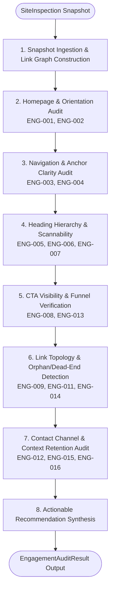

# Engagement & Recommendations Audit Skill

## Purpose
The `engagement-recommendations` skill evaluates whether a website provides intuitive orientation, clear navigation pathways, and actionable journeys for human visitors and autonomous AI exploration agents. It systematically audits 10 key engagement dimensions—including homepage orientation, navigation reachability, heading hierarchies (H1–H6), call-to-action (CTA) clarity, internal link topology, related content continuation, contact mechanisms, conversion paths, dead ends, and direct-landing context retention—without mutating remote website state.

## When to Use
Use this skill when:
- Evaluating whether autonomous exploration agents and visitors can readily understand what an organization does upon landing.
- Detecting broken conversion funnels, dead-end pages (zero outgoing links), or orphaned subpages that trap crawlers.
- Identifying missing or non-descriptive calls-to-action (CTAs) and vague anchor text ("click here", "read more").
- Verifying heading progression (H1 -> H2 -> H3) and document scannability.
- Auditing whether deep landing pages provide sufficient brand identity, breadcrumb paths, and navigation back to parent categories.
- Generating concrete, evidence-backed remediation recommendations with verifiable test steps.

## Safe and Read-Only Behavior
This skill strictly adheres to read-only, non-destructive inspection:
- **No Mutation:** Never submits forms, clicks state-altering buttons, or modifies server-side state.
- **Offline Analysis:** Operates purely on serialized `SiteInspection` or `SiteSnapshot` structures generated by the crawler.
- **Strict Evidence Standard:** Every reported finding references exact URLs and concrete textual or DOM evidence.
- **Deterministic Evaluation:** Severity and confidence scores are computed deterministically without subjective speculation.

## Inputs
| Parameter | Type | Default | Description |
| :--- | :--- | :--- | :--- |
| `snapshot` | `SiteInspection` \| `SiteSnapshot` \| `dict` | *(required)* | Pre-extracted site inspection observation or serialized snapshot dictionary. |
| `confidence_threshold` | `float` | `0.70` | Minimum confidence score (0.0 to 1.0) required to include and report a finding. |

## Procedure

The engagement inspection pipeline evaluates 10 key structural dimensions:



### 10 Evaluated Audit Dimensions:
1. **Homepage Orientation (`ENG-001`, `ENG-002`)**: Verifies brand identity clarity in `<title>`, `<h1>`, and introductory value proposition text.
2. **Navigation Descriptiveness (`ENG-003`, `ENG-004`)**: Analyzes anchor text descriptiveness and flags generic labels ("click here") and unreachable menu links.
3. **Information Hierarchy (`ENG-005`, `ENG-006`, `ENG-007`)**: Checks heading level progression, flags multiple H1s, and detects dense unscannable text blocks lacking subheadings.
4. **CTA Clarity (`ENG-008`)**: Detects missing or obscured primary calls-to-action on key landing surfaces.
5. **Internal Linking Topology (`ENG-009`)**: Builds an internal link graph to identify orphaned or poorly connected pages.
6. **Related Content Continuation (`ENG-011`)**: Flags substantive informational pages that lack onward continuation links.
7. **Contact Pathways (`ENG-012`)**: Verifies the presence of reachable contact pages, support channels, email, or telephone data.
8. **Conversion Pathways (`ENG-013`)**: Ensures commercial and pricing pages provide actionable next steps (signup, quote, demo, purchase).
9. **Dead Ends (`ENG-014`)**: Flags pages with zero outgoing internal links that terminate user journeys.
10. **Context Retention (`ENG-015`, `ENG-016`)**: Audits deep landing pages for breadcrumbs, parent links, and topic headings so direct-landing users retain context.

## Outputs

Returns an `EngagementAuditResult` containing:
- **`skill`**: `"engagement-recommendations"`
- **`status`**: `"success"`
- **`site`**: Domain hostname (e.g. `"example.com"`).
- **`total_findings`**: Number of findings meeting the confidence threshold.
- **`severity_counts`**: Breakdown across `critical`, `high`, `medium`, `low`, and `info`.
- **`metrics`**: Quantitative engagement metrics:
  - `pages_audited`: Total pages evaluated.
  - `internal_link_count`: Total internal hyperlinks discovered.
  - `orphan_page_count`: Number of pages with zero incoming links.
  - `dead_end_count`: Number of pages with zero outgoing links.
  - `has_homepage_cta`: Boolean indicator of clear homepage CTA.
  - `has_contact_channel`: Boolean indicator of discoverable contact details.
  - `avg_headings_per_page`: Average heading density per page.
- **`findings`**: List of `EngagementFinding` objects matching the standardized contract:
  - `id`: Finding identifier (`ENG-001` through `ENG-016`).
  - `category`: `"orientation"`, `"navigation"`, `"hierarchy"`, `"cta"`, `"link_graph"`, `"continuation"`, `"contact"`, `"conversion"`, `"dead_end"`, or `"context_retention"`.
  - `title`: Human-readable summary.
  - `severity`: `"critical"`, `"high"`, `"medium"`, `"low"`, or `"info"`.
  - `confidence`: Calibrated certainty score (0.00 to 1.00).
  - `evidence`: Specific textual excerpt and source URL attribution.
  - `affected_urls`: List of affected page URLs.
  - `suggested_action`: Prescriptive remediation with `summary` and `priority`.

## Usage and Pipeline Integration

### Python API
```python
from src.inspection import inspect_site
from src.engagement import audit_engagement, EngagementAuditResult

# 1. Obtain inspection data via crawl-render-audit
site_inspection = inspect_site(url="https://example.com", max_pages=10)

# 2. Run Engagement & User Journey Audit
engagement_result: EngagementAuditResult = audit_engagement(
    snapshot=site_inspection,
    confidence_threshold=0.70,
)

# 3. Access findings and quantitative metrics
print(f"Site: {engagement_result.site}")
print(f"Total Findings: {engagement_result.total_findings}")
print(f"Orphan Pages: {engagement_result.metrics.orphan_page_count}")
print(f"Dead End Pages: {engagement_result.metrics.dead_end_count}")

for f in engagement_result.findings:
    print(f"[{f.severity.value.upper()}] {f.id}: {f.title}")
    print(f"  Evidence: {f.evidence}")
    print(f"  Action: {f.suggested_action.summary}\n")
```

### Standalone CLI Execution
```bash
# Run engagement audit on a serialized snapshot
python skills/engagement-recommendations/scripts/audit.py snapshot.json --threshold 0.70
```
