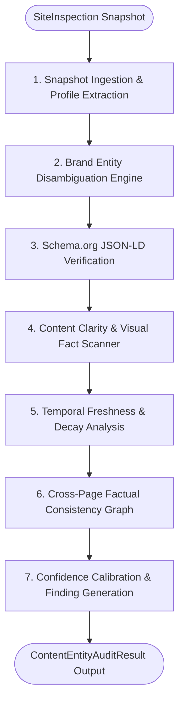

# Entity, Content, Freshness & Trust Audit Skill

## Purpose
The `entity-content-freshness-trust` skill evaluates whether search engines, knowledge engines, and autonomous AI agents can correctly comprehend, ground, and trust a brand or organization's website. It systematically audits brand entity disambiguation, structured Schema.org JSON-LD markup, facts locked in non-text images, temporal currency, and cross-page factual consistency without mutating remote site state.

## When to Use
Use this skill when:
- An orchestrator or audit pipeline needs to evaluate whether a website's brand identity is explicit, machine-readable, and unambiguous.
- Verifying Schema.org `Organization` or `LocalBusiness` JSON-LD coverage and field completeness.
- Detecting ungrounded marketing superlatives ("#1 leader", "world's best") lacking corroborating data.
- Identifying critical facts (certifications, pricing, operational metrics, timelines) trapped inside image assets lacking text alternatives.
- Detecting stale copyright dates, outdated announcements presented as current, and temporal decay.
- Discovering cross-page factual contradictions (conflicting founding years, pricing, headquarters locations, telephone numbers) across different pages on the domain.
- Calibrating audit findings with high-precision confidence scoring and false-positive suppression.

## Safe and Read-Only Behavior
This skill operates strictly on static or pre-extracted website snapshots:
- **No Mutation:** Never submits forms, modifies remote state, or performs intrusive actions.
- **Offline Analysis:** Operates purely on serialized `SiteInspection` or `SiteSnapshot` structures generated by the crawler.
- **Strict Evidence Standard:** Every reported finding references exact URLs and concrete textual excerpts from the rendered DOM. Speculative or low-confidence findings are discarded.
- **False-Positive Hardening:** Built-in semantic filtering prevents spurious contradictions on legitimate multi-tier donation/pricing options and distinct departmental email addresses.

## Inputs
| Parameter | Type | Default | Description |
| :--- | :--- | :--- | :--- |
| `snapshot` | `SiteInspection` \| `SiteSnapshot` \| `dict` | *(required)* | Pre-extracted site inspection observation or serialized snapshot dictionary. |
| `confidence_threshold` | `float` | `0.70` | Minimum confidence score (0.0 to 1.0) required to retain and report a finding. |

## Procedure

The inspection follows a deterministic, 6-stage analysis pipeline:



### Step-by-Step Execution:
1. **Snapshot Ingestion**: Ingests raw `SiteInspection` data, extracting page texts, headings, metadata, and JSON-LD blocks across all crawled pages.
2. **Entity Identity Disambiguation**: Extracts brand name, industry, headquarters, founding date, and contact points from title tags, headers, and meta schemas; constructs an `EntityProfile`.
3. **Structured Data Verification**: Evaluates whether root and deep pages provide valid Schema.org `Organization`, `Corporation`, or `LocalBusiness` JSON-LD schemas (`EC-003`).
4. **Content Clarity & Visual Fact Scan**: Flags ungrounded superlatives (`CC-001`), missing organizational attributes (`CC-003`), and key facts trapped in non-alt images (`CC-002`).
5. **Temporal Freshness & Decay Analysis**: Detects copyright year lag (`FR-001`), outdated event announcements presented as current (`FR-002`), and stale historical dates.
6. **Cross-Page Factual Consistency Graph**: Builds a knowledge graph of extracted claims (founding years, pricing numbers, addresses, contact emails) across all pages and identifies cross-page contradictions (`CO-001`).
7. **Confidence Calibration & Finding Generation**: Applies domain-aware false-positive suppression, filters findings against `confidence_threshold`, and formats standardized remediation actions.

## Outputs

Returns a standardized `ContentEntityAuditResult` matching Adobe Hackathon contracts:
- **`skill`**: `"entity-content-freshness-trust"`
- **`status`**: `"success"` or `"partial_failure"`
- **`site`**: Domain hostname (e.g. `"example.com"`).
- **`total_findings`**: Total number of findings meeting the confidence threshold.
- **`severity_counts`**: Breakdown across `critical`, `high`, `medium`, `low`, and `info`.
- **`entity_profile`**: Consolidated brand knowledge profile (`name`, `type`, `description`, `industry`, `founding_year`, `contact_email`, `contact_phone`, `social_profiles`, `confidence_score`).
- **`findings`**: List of `Finding` objects containing:
  - `id`: Machine-readable code:
    - `EC-001` / `EC-002` / `EC-003`: Entity identification and Schema.org findings.
    - `CC-001` / `CC-002` / `CC-003`: Content clarity, ungrounded superlatives, and image data accessibility.
    - `FR-001` / `FR-002`: Temporal freshness and copyright lag.
    - `CO-001`: Cross-page factual contradictions.
  - `category`: `"entity"`, `"content_clarity"`, `"freshness"`, or `"consistency"`.
  - `title`: Concise human-readable summary.
  - `severity`: `"critical"`, `"high"`, `"medium"`, `"low"`, or `"info"`.
  - `confidence`: Calibrated certainty score (0.00 to 1.00).
  - `evidence`: Exact textual excerpt and source URL attribution.
  - `affected_urls`: List of affected page URLs.
  - `suggested_action`: Prescriptive remediation with `summary` and `priority`.

## Usage and Pipeline Integration

### Python API
```python
from src.entity_trust import audit_entity_trust, ContentEntityAuditResult
from src.inspection import inspect_site

# 1. Generate inspection observation via crawl-render-audit
site_inspection = inspect_site(url="https://example.com", max_pages=10)

# 2. Run entity, content freshness, and trust audit
audit_result: ContentEntityAuditResult = audit_entity_trust(
    snapshot=site_inspection,
    confidence_threshold=0.70,
)

# 3. Access calibrated findings
print(f"Site: {audit_result.site}")
print(f"Identified Entity: {audit_result.entity_profile.name} (Industry: {audit_result.entity_profile.industry})")
print(f"Total Findings: {audit_result.total_findings}")

for finding in audit_result.findings:
    print(f"[{finding.severity.upper()}] {finding.id}: {finding.title}")
    print(f"  Confidence: {finding.confidence}")
    print(f"  Evidence: {finding.evidence}")
    print(f"  Action: {finding.suggested_action.summary}\n")
```

### Standalone CLI Execution
```bash
# Run full entity & trust audit on a serialized snapshot
python skills/entity-content-freshness-trust/scripts/audit.py snapshot.json --threshold 0.70

# Check cross-page factual consistency specifically
python skills/entity-content-freshness-trust/scripts/consistency.py snapshot.json
```
